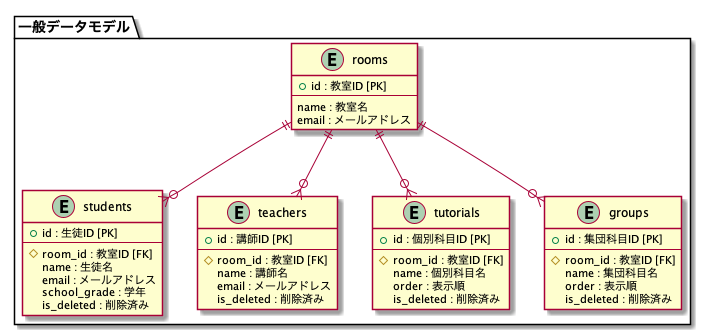
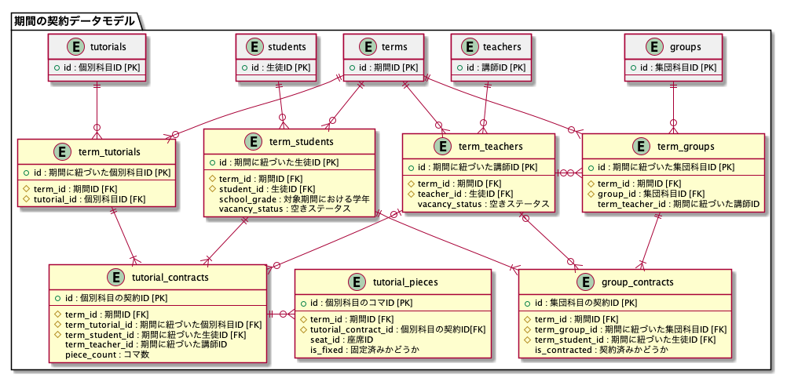
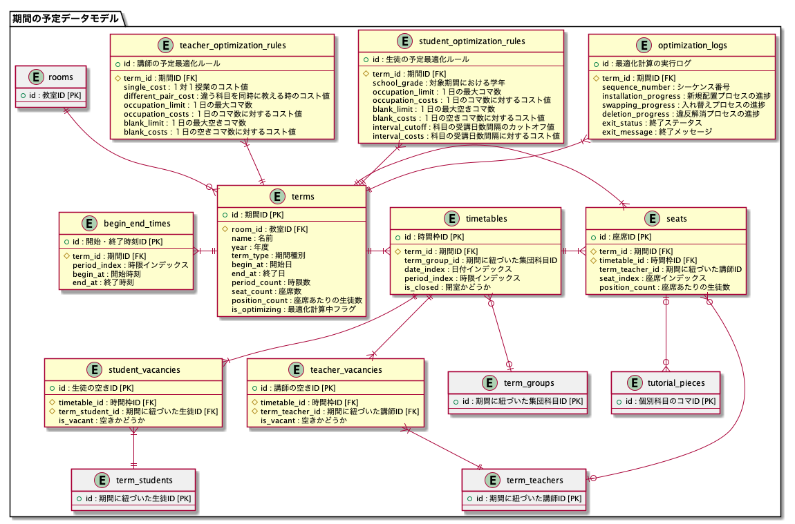

# 設計ドキュメント

## データモデル




## API設計書
[最適化モジュール向けAPI](./openapi.yml)

## Swaggger（OepnAPI）について

* APIドキュメントは[OpenAPI3](https://swagger.io/specification/)のフォーマットに従って作成する。作成時は、次のプラグインを用いるとドキュメントのプレビューが可能。
  * VSCodeプラグインでのプレビュー：[openapi-preview](https://marketplace.visualstudio.com/items?itemName=zoellner.openapi-preview)
  * GoogleChromeプラグインでのプレビュー：[swagger-viewer](https://chrome.google.com/webstore/detail/swagger-viewer/nfmkaonpdmaglhjjlggfhlndofdldfag)

* 更新時は以下のコマンドで`openapi.yml`に結合する。

```shell
npx swagger-cli bundle --dereference -o ./openapi.yml -t yaml ./root.yml
```

* `swagger-ui`の起動コマンド

```shell
docker pull swaggerapi/swagger-ui
docker run -p 3000:8080 -e SWAGGER_JSON=/swagger/openapi.yml -v `pwd`:/swagger swaggerapi/swagger-ui
```

## API設計ルール

* 属性の型定義
  * `type`、`description`、`example`を定義する。
  * `type=string`の場合、次のいずれかの型で定義する。
    * 自由記述型：`minimum`と`maximum`を定義する。`minimum`は`0`もしくは`1`とする。`maximum`は`10`、`20`、`40`、`100`もしくは`200`とする。`nullable`は許容しない。
    * 定型型：電話番号やメールアドレスなど、正規表現で定義される文字列。`pattern`を定義する。未入力の状態が許容される場合は`nullable`を定義する。
    * 列挙型：`enum`で許容される値を列挙する。未入力の状態が許容される場合は`nullable`を定義する。
  * `type=integer`の場合、次のいずれかの型で定義する。
    * ID型：主キーや外部キーとなる値。関係が存在しない状態を許容する場合は`nullable`を定義する。
    * 数値型：必要に応じて`minimum`と`maximum`を定義する。未入力の状態が許容される場合は`nullable`を定義する。
    * コード型：`enum`、もしくは、`minimum`と`maximum`で許容される値を定義する。未入力の状態が許容される場合は`nullable`を定義する。

* レスポンスステータス
  * `200`：ok
  * `201`：created
  * `204`：no_content
  * `400`：bad_request、リクエスト形式エラー
  * `401`：unauthorized、認証系エラー
  * `403`：forbidden、認可系エラー
  * `404`：resource_not_found、リソースが見つからないエラー
  * `500`：internal_server_error、サーバー内部処理エラー
  * `503`：service_unavailable、サーバーメンテナンス中

